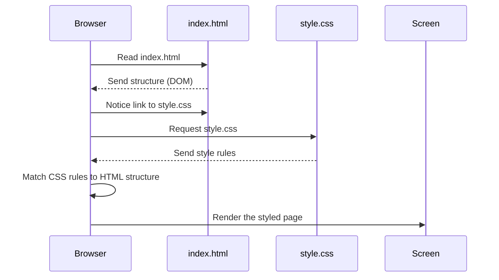

# Chapter 1: Visual Layout & Styling (HTML/CSS)

Welcome to the `monopoly-clone-og` project! This is the very first chapter where we'll explore how the game gets its looks. Ever wonder how the game board, the colourful properties, the dice, and all the buttons appear on your screen? That's what we'll dive into right now!

## What's the Big Idea? Making the Game Look Right!

Imagine you're building a house. You first need a blueprint and then the actual frame, walls, and roof – the *structure*. After that, you paint the walls, add furniture, and decorate – the *style*.

In web development, and in our Monopoly game, we do something similar:

1.  **HTML (HyperText Markup Language):** This is like the **blueprint and frame** of our game's interface. It defines all the different parts: the board itself, each property square, the areas showing player money, buttons to roll the dice, pop-up windows, etc. It gives our game its structure.
2.  **CSS (Cascading Style Sheets):** This is like the **paint, furniture, and decorations**. It takes the structure defined by HTML and makes it look good. CSS controls colours, sizes, fonts, where things are placed on the screen, and even simple animations (like making a house icon rotate!).

Together, HTML (`index.html`) and CSS (`style.css`) create the visual experience of the Monopoly game board and all its interface elements.

**Our Goal:** Understand how HTML creates the basic parts of the game screen and how CSS makes them look like a Monopoly board. Let's focus on creating a single square on the board and giving it a colour.

## Key Concepts: The Building Blocks

### 1. HTML: The Skeleton (`index.html`)

Think of HTML as using special tags to describe the content. For example, `<div>` is often used as a container or a box for other elements, `<button>` creates a clickable button, and `` shows an image.

Each tag can have *attributes* that provide more information. A common attribute is `class`, which groups elements for styling, or `id`, which gives a unique name to one specific element. In our game, we also use `data-id` to easily identify specific board squares (like square 1, square 2, etc.).

Here’s a tiny piece of `index.html` defining the "GO" corner square (which we'll simplify slightly):

```html
<!-- Part of index.html -->
<div class="map"> <!-- The main container for the board -->
  <!-- The 'GO' square - Square number 1 -->
  <div class="map__box" data-id="1">
      <!-- Content inside the GO square might go here later -->
  </div>
  <!-- ... other squares would go here ... -->
</div>
```

*   `<div class="map">`: This is a box holding the entire game board.
*   `<div class="map__box" data-id="1">`: This is another box representing a single square on the board.
    *   `class="map__box"`: Tells us this is a standard board square (useful for general styling).
    *   `data-id="1"`: Specifically identifies this as the first square (the "GO" square).

This HTML creates the *structure*: a box for the board containing another box for the first square. But it doesn't have any specific look yet!

### 2. CSS: The Decoration (`style.css`)

Now, let's add some style! CSS works by selecting HTML elements and applying rules to them. A rule consists of a *selector* (which element(s) to target) and *declarations* (what style to apply, like `property: value;`).

Our `style.css` file contains many rules. Let's look at a simplified rule to style our "GO" square:

```css
/* Part of style.css */

/* Select the div with class 'map__box' AND data-id attribute equal to '1' */
.map__box[data-id="1"] {
  background-color: coral; /* Give it a coral background color */
  /* These lines position and size the square on the board grid */
  grid-area: 1 / 1 / 3 / 3;
}
```

*   `.map__box[data-id="1"]`: This is the selector. It finds the specific `<div>` we created in HTML that has *both* the class `map__box` and the attribute `data-id` set to `1`.
*   `background-color: coral;`: This is a declaration. It sets the background colour of the selected element to coral.
*   `grid-area: 1 / 1 / 3 / 3;`: This is another declaration using CSS Grid layout (a way to arrange items in rows and columns). It tells the browser exactly where to place this square on our game board grid – specifically, in the top-left corner, spanning the first two rows and first two columns of the grid setup.

## How it Works Together: From Code to Visuals

So, how does the simple HTML box become a coloured square in the corner of our game board?

1.  Your web browser (like Chrome, Firefox, etc.) opens the `index.html` file.
2.  It reads the HTML tags and understands the structure: "Okay, there's a main `map` box, and inside it, the first thing is a `map__box` with `data-id="1"`."
3.  The browser sees this line inside the `<head>` section of the HTML: `<link rel="stylesheet" href="style.css">`. This tells it to also load the `style.css` file.
4.  The browser reads the CSS rules in `style.css`.
5.  It matches the CSS rules to the HTML elements. It finds the rule `.map__box[data-id="1"]` and applies its styles (like the `background-color` and `grid-area`) to the corresponding `<div>` in the HTML.
6.  Finally, the browser *renders* (draws) the result on your screen: you see the game board structure, and the top-left corner square is now coral-coloured and positioned correctly!

Here's a simplified diagram showing the process:



## A Peek Inside the Code

Let's look at slightly more context from the actual files.

**`index.html` (Simplified Snippet):**

```html
<!DOCTYPE html>
<html>
<head>
    <title>Monopoly Clone</title>
    <!-- This line connects the CSS file -->
    <link rel="stylesheet" href="style.css">
</head>
<body>
    <!-- Main container for the whole game interface -->
    <div class="container">
        <!-- The game board grid -->
        <div class="map">
            <!-- Square 1: The 'GO' square -->
            <div class="map__box" data-id="1">
                <!-- Maybe text or icons go here later -->
            </div>

            <!-- Square 2: A property square -->
            <div class="map__box map__box-bottom" data-id="2">
                <!-- Elements for houses might go here -->
            </div>

            <!-- ... many more map__box divs for all 40 squares ... -->

            <!-- Buttons and overlays live inside the map too -->
            <button class="rollDice btn">Roll Dice</button>
            <span class="map__overlay"></span> <!-- Used for initial screen -->
        </div>

        <!-- The player stats area on the side -->
        <section class="section__stats">
            <!-- Player info will be added here -->
        </section>
    </div>

    <!-- The JavaScript file is usually linked at the end -->
    <script src="script.js"></script>
</body>
</html>
```

This shows the basic page structure, the link to `style.css`, the main `container`, the `map` div, and examples of individual `map__box` divs for the squares. Notice how different squares might have slightly different classes (`map__box-bottom`) for positioning or specific styling.

**`style.css` (Simplified Snippet):**

```css
/* Basic reset: remove default browser margins/paddings */
*, *::before, *::after {
  margin: 0;
  padding: 0;
  box-sizing: border-box; /* Makes sizing elements easier */
}

/* Style the main game board container */
.map {
  min-width: 870px; /* Minimum size */
  min-height: 870px;
  background-color: rgb(206, 233, 179); /* Light green background */
  display: grid; /* Use CSS Grid for layout! */
  /* Define the grid columns and rows */
  grid-template-columns: 45px repeat(11, 1fr) 45px;
  grid-template-rows: 45px repeat(11, 1fr) 45px;
  position: relative; /* Needed for positioning things inside */
}

/* Style the 'GO' square (Square 1) */
.map__box[data-id="1"] {
  background-color: coral;
  /* Place it in the grid: row 1, col 1, spanning 2 rows/cols */
  grid-area: 1 / 1 / 3 / 3;
  position: relative; /* Allows positioning elements inside it */
}

/* Style a regular property square on the bottom row */
.map__box-bottom {
  background-color: rgb(226, 186, 172); /* A different background */
  grid-row: 1 / 3; /* Place it in the top row area (spanning rows 1-2) */
}

/* Style the dice rolling button */
.rollDice {
  position: absolute; /* Position relative to the map */
  top: 60%; /* Place it vertically */
  left: 50%; /* Place it horizontally */
  transform: translate(-50%, -50%); /* Center it precisely */
  display: none; /* Hide it initially */
  z-index: 100; /* Make sure it's above the board squares */
  padding: 1rem 1.8rem; /* Add some space inside the button */
  /* More styling for colors, borders etc. */
}
```

Here you see the basic reset, the setup for the `.map` using `display: grid`, and specific rules for the 'GO' square (`.map__box[data-id="1"]`) and other squares like `.map__box-bottom`. The `.rollDice` rule shows how CSS positions elements (`position: absolute`, `top`, `left`, `transform`) and controls visibility (`display: none`).

## What's Next?

We've seen how HTML structures the game's visual elements and how CSS styles them to create the look and feel of the Monopoly board. This gives us the static *appearance* of the game.

But how do we make the game interactive? How do player pieces move? How do dice rolls appear? How does player money get updated on the screen?

That's where JavaScript comes in! The HTML and CSS provide the stage and the scenery, but JavaScript is the director and the actors, making things happen dynamically. Our next chapter will introduce the first part of our JavaScript logic: the [UI Controller (`UIController`)](02_ui_controller___uicontroller___.md), which is responsible for updating what you see on the screen based on the game's state.

---

Generated by [AI Codebase Knowledge Builder](https://github.com/The-Pocket/Tutorial-Codebase-Knowledge)