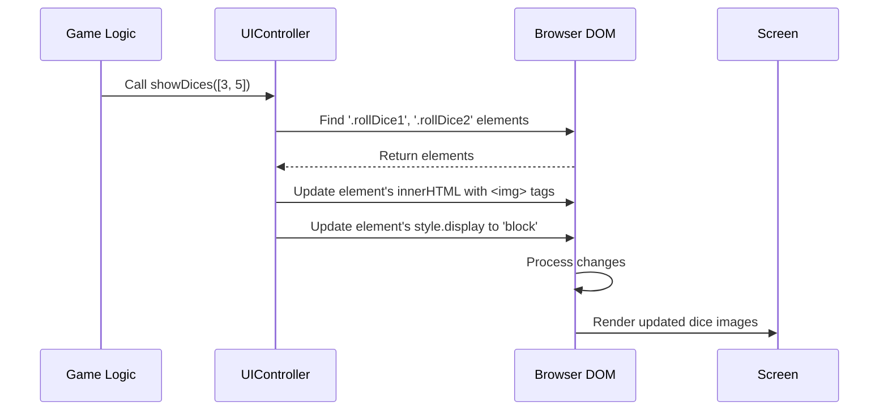

# Chapter 2: UI Controller (`UIController`)

Welcome to Chapter 2! In [Chapter 1: Visual Layout & Styling (HTML/CSS)](01_visual_layout___styling__html_css__.md), we learned how `index.html` creates the structure (like the board squares and buttons) and `style.css` makes it look like a Monopoly game. But right now, our game board is just a pretty picture – nothing moves, nothing changes!

How do we make the game come alive? How does a player's piece actually *move* on the screen? How do the dice images appear when someone rolls? That's where our first piece of JavaScript magic comes in: the **UI Controller**.

## What's the Big Idea? Making the Game Visually Dynamic!

Imagine you're watching a puppet show. You have the stage (HTML) and the painted scenery (CSS). The **UI Controller** is like the puppeteer's hands. It doesn't decide the story (that's the Game Logic), but it physically moves the puppets (the visual elements) on the stage so the audience can see what's happening.

The `UIController`'s main job is:

1.  **Listen** for instructions from other parts of the game (like "Player 1 rolled a 5!").
2.  **Find** the right elements on the web page (HTML elements, like a specific player token or the dice area).
3.  **Update** those elements visually (move the token, show the dice images, display updated money).

It acts as the bridge between the game's data (like player position or dice numbers) and what the user *sees* on the screen.

**Our Goal:** Understand how the `UIController` takes a simple piece of information, like the result of a dice roll, and updates the screen to show the correct dice images.

## Key Concepts: JavaScript Enters the Scene

### 1. JavaScript (JS): The Action Hero

While HTML gives structure and CSS adds style, **JavaScript** adds interactivity and dynamic behaviour. It's a programming language that runs directly in your web browser. It can:

*   React to user actions (like button clicks).
*   Change the content and style of HTML elements *after* the page has loaded.
*   Perform calculations and manage game data.
*   Communicate with other parts of the game logic.

In our project, the `script.js` file contains all our JavaScript code.

### 2. The DOM: JavaScript's View of the HTML

How does JavaScript "see" and interact with the HTML elements we defined in `index.html`? Through something called the **Document Object Model (DOM)**.

Think of the DOM as a tree-like map of your HTML page that the browser creates. Each HTML tag (like `<div>`, `<button>`, ``) becomes an object (a "node") in this map. JavaScript can navigate this map to find specific elements (like the button with class `rollDice` or the `<div>` with `data-id="5"`) and then change their properties (like their text, their style, or their image source).

### 3. `UIController`: The Visual Specialist

Our `script.js` file is organized into different sections using a technique called the **Module Pattern**. The `UIController` is one such module – a self-contained block of code focused *only* on updating the User Interface (UI). It groups together all the functions responsible for showing things on the screen. This keeps our code tidy!

## Example Use Case: Showing the Dice Roll

Let's say the game logic determines a player rolled a 3 and a 5. The `UIController` needs to make the images for a '3' die and a '5' die appear on the screen.

How does it do this? It has a specific function, let's call a simplified version `showDices`, that takes the dice numbers as input.

```javascript
// Inside script.js, within the UIController module

// Function to display the dice images
showDices: function(dices) { // 'dices' is an array, e.g., [3, 5]
  console.log('UIController: I need to show dice:', dices);

  // 1. Find the HTML elements where dice should appear
  // (Uses the DOM to find elements with specific classes)
  var diceElement1 = document.querySelector('.rollDice1');
  var diceElement2 = document.querySelector('.rollDice2');

  // 2. Create the HTML code for the dice images
  // We know the images are named like 'dice-1.png', 'dice-2.png', etc.
  var htmlDice1 = ''; // uses dices[0] (which is 3)
  var htmlDice2 = ''; // uses dices[1] (which is 5)

  // 3. Put the image HTML into the found elements
  diceElement1.innerHTML = htmlDice1;
  diceElement2.innerHTML = htmlDice2;

  // 4. Make sure these elements are visible (they might be hidden initially)
  diceElement1.style.display = 'block';
  diceElement2.style.display = 'block';
}
```

**Explanation:**

1.  **`showDices: function(dices)`**: This defines the function named `showDices`. It expects one piece of information (an *argument*) called `dices`, which we know will be an array like `[3, 5]`.
2.  **`document.querySelector('.rollDice1')`**: This is JavaScript using the DOM! It tells the browser: "Find the *first* HTML element that has the class `rollDice1`." (We defined these `<div>`s in `index.html` in Chapter 1).
3.  **`var htmlDice1 = ...`**: This creates a string of HTML code. If `dices` is `[3, 5]`, this line creates the string ``.
4.  **`diceElement1.innerHTML = htmlDice1;`**: This is the magic! It takes the HTML string we just created and puts it *inside* the `.rollDice1` div on the page. The browser automatically renders this new HTML, showing the dice image.
5.  **`diceElement1.style.display = 'block';`**: This changes the CSS `display` property of the element, making sure it's visible on the screen (it might have been hidden using `display: none;` in the CSS).

**Input:** `dices = [3, 5]` is passed to the `showDices` function.

**Output:** The user sees the image `dices/dice-3.png` appear in the area designated by the `.rollDice1` div, and `dices/dice-5.png` appear in the `.rollDice2` div area.

## How it Works Under the Hood

Let's trace the steps when the game needs to show a dice roll of `[3, 5]`:

1.  **Game Logic:** Somewhere else in the code (we'll see where in later chapters), the game calculates the dice roll: `[3, 5]`.
2.  **Instruction:** That other part of the code calls our `UIController`'s function: `UIController.showDices([3, 5])`.
3.  **UIController Action:**
    *   The `showDices` function inside `UIController` starts running.
    *   It uses `document.querySelector` to find the specific `<div>` elements in the HTML (`.rollDice1` and `.rollDice2`).
    *   It generates the correct `` HTML strings for dice 3 and 5.
    *   It uses `.innerHTML` to inject this HTML into the found `<div>`s in the DOM.
    *   It uses `.style.display` to make sure the `<div>`s (and the new images inside them) are visible.
4.  **Browser Renders:** The browser detects the changes to the DOM and updates what's drawn on the screen.
5.  **User Sees:** The player sees the dice images (3 and 5) appear on the game board interface.

Here's a simplified diagram of that flow:



## Code Dive: Finding `UIController` in `script.js`

If you open the `script.js` file, you'll find the `UIController` defined like this (simplified):

```javascript
// Part of script.js

// The UIController is defined using an Immediately Invoked Function Expression (IIFE)
// This helps keep its variables and functions private, only exposing what we need.
var UIController = (function() {

  // --- Private stuff would go here ---
  // For example, maybe shortcuts to frequently used DOM elements.

  // --- Public stuff is returned ---
  // These are the functions that other parts of the code can call.
  return {

    // Example: Function to get references to important HTML elements
    getDomStrings: function() {
      // Returns an object containing CSS selectors we use often
      return {
        dice: '.rollDice', // Selector for the 'Roll Dice' button
        startGame: '.startGame', // Selector for the 'New Game' button
        // ... other selectors
      };
    },

    // Our function to show the dice (slightly simplified from actual code)
    showDices: function(dices) {
      var diceElement1 = document.querySelector('.rollDice1');
      var diceElement2 = document.querySelector('.rollDice2');
      var playerNumberElement = document.querySelector('.playerNumber');

      var htmlDice1 = '';
      var htmlDice2 = '';

      diceElement1.innerHTML = htmlDice1;
      diceElement2.innerHTML = htmlDice2;
      diceElement1.style.display = 'block';
      diceElement2.style.display = 'block';

      playerNumberElement.innerHTML = '<h2>Rolled: ' + (dices[0] + dices[1]) + '</h2>';
      playerNumberElement.style.display = 'block';

      // It also updates the dice shown next to the player's name in the stats panel!
      // (Simplified - actual code finds the specific player's stats area)
      var statsDiceArea = document.querySelector('.stats__rolled1'); // Example for player 1
      if (statsDiceArea) {
        var statsHtmlDice1 = '';
        var statsHtmlDice2 = '';
        statsDiceArea.innerHTML = '<h2>Rolled: ' + (dices[0] + dices[1]) + '</h2>' + statsHtmlDice1 + statsHtmlDice2;
      }
    },

    // Function to hide the dice images again
    hideDices: function() {
      document.querySelector('.rollDice1').innerHTML = ''; // Clear the content
      document.querySelector('.rollDice1').style.display = 'none'; // Hide the element
      document.querySelector('.rollDice2').innerHTML = '';
      document.querySelector('.rollDice2').style.display = 'none';
      document.querySelector('.playerNumber').innerHTML = '';
      document.querySelector('.playerNumber').style.display = 'none';
    },

    // Function to move a player's token on the board
    updatePlayerSpot: function(player) { // 'player' is an object with player data
      // 1. Find and remove the player's token from its old spot
      var oldToken = document.querySelector('.map__player' + player.id);
      if (oldToken) {
        oldToken.parentNode.removeChild(oldToken);
      }

      // 2. Find the new square element using the player's mapSpot property
      var newSquare = document.querySelector('[data-id="' + player.mapSpot + '"]');

      // 3. Create the HTML for the player's token
      var tokenHtml = '<div class="map__player' + player.id + '" style="display:inline-flex;">'
                    + '<div class="map__box2 index100" style="border: 1px solid #000; width: 27px; height: 27px; background-color:orange; border-radius:50%; display:inline-flex; justify-content: center;">'
                    + '<span class="map__char" style="display:flex; align-items: center; font-size: 22px;">' + player.char + '</span>'
                    + '</div></div>';

      // 4. Add the token HTML to the new square
      if (newSquare) {
        newSquare.insertAdjacentHTML('beforeend', tokenHtml);
      }
    },

    // ... many other functions for updating different parts of the UI ...
    // (like showPlayerDashboard, showCard, updateBudget display, etc.)

  };
})(); // The () at the end executes the function immediately
```

This snippet shows the basic structure. The `UIController` object contains many functions (`showDices`, `hideDices`, `updatePlayerSpot`, etc.). Each function knows exactly which HTML elements to find (using `querySelector`) and how to change them (`innerHTML`, `style`, `insertAdjacentHTML`) to reflect the current state of the game.

## Connecting the Dots

It's important to remember that the `UIController` is like a skilled painter – it knows *how* to paint (update the screen), but it doesn't decide *what* to paint or *when*.

*   The **[Game Logic (`gameLogic`)](04_game_logic___gamelogic___.md)** module is responsible for the rules of Monopoly – calculating dice rolls, determining player movement, managing money, etc. It holds the game's *state*.
*   The **[Game Orchestrator (`controller`)](03_game_orchestrator___controller___.md)** module acts as the director. It coordinates the flow of the game. It gets information from the `gameLogic` (like a dice roll result) and then tells the `UIController` what to display (e.g., "Hey `UIController`, show these dice: `[3, 5]`").

We'll explore these other modules in the upcoming chapters.

## What's Next?

We've seen how the `UIController` uses JavaScript to dynamically update the visual presentation of the game based on instructions. It takes the static stage built by HTML/CSS and makes it come alive by manipulating the DOM.

But who tells the `UIController` *what* to do and *when*? How does a button click trigger a dice roll, which then triggers the `UIController`? That's the job of the **Game Orchestrator**, often just called the `controller`. In the next chapter, we'll dive into how the [Game Orchestrator (`controller`)](03_game_orchestrator___controller___.md) manages the game flow and connects user actions, game logic, and UI updates.

---

Generated by [AI Codebase Knowledge Builder](https://github.com/The-Pocket/Tutorial-Codebase-Knowledge)