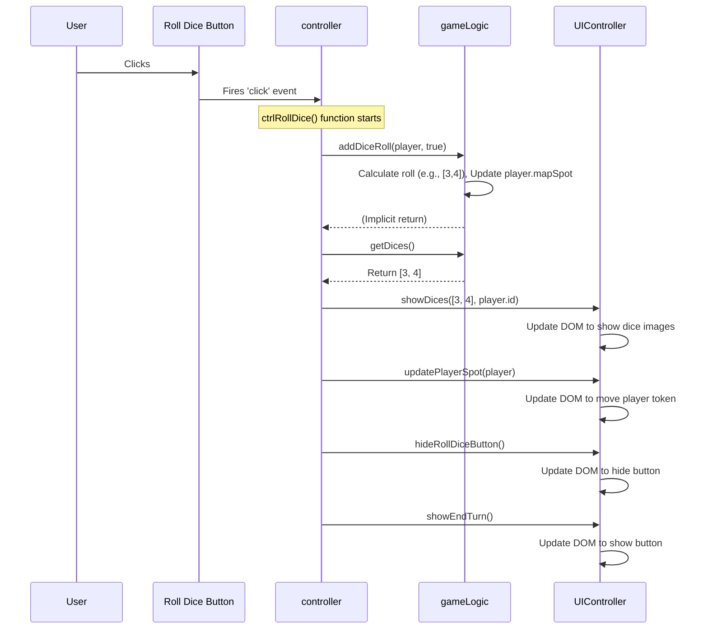

# Chapter 3: Game Orchestrator (`controller`)

Welcome to Chapter 3! In [Chapter 2: UI Controller (`UIController`)](02_ui_controller___uicontroller___.md), we saw how the `UIController` acts like a puppeteer, visually updating the game board (the DOM) based on instructions. It can show dice, move player tokens, and update money displays.

But who *gives* the `UIController` these instructions? And how does a player's click on a button, like "Roll Dice", actually lead to the dice appearing on screen and the player moving? That's where the **Game Orchestrator**, which we simply call the `controller` in our code, comes in.

## What's the Big Idea? Directing the Game!

Imagine a movie set. You have the actors (`UIController` making visual changes) and the script (the rules of Monopoly, handled by `gameLogic`). The **`controller`** is the **Director** on set.

The Director doesn't act and doesn't write the script, but they tell everyone what to do and when:

1.  **Listens** for cues (like the player clicking a button - "Action!").
2.  **Instructs** the script department (`gameLogic`) to perform calculations based on the rules ("Roll the dice according to the script!").
3.  **Receives** the results ("The roll is a 7!").
4.  **Instructs** the actors (`UIController`) to update the scene ("Show dice 3 and 4! Move the player 7 spaces!").

The `controller` manages the overall *flow* of the game. It connects the user's actions, the game's rules, and the visual display, making sure everything happens in the correct sequence.

**Our Goal:** Understand how the `controller` handles a simple player action: clicking the "Roll Dice" button. We'll see how it coordinates between the user, the game rules, and the screen updates.

## Key Concepts: Making Connections

### 1. Event Listeners: Waiting for Action

How does the game know when you click a button? JavaScript allows us to attach **Event Listeners** to HTML elements. Think of an event listener as a tiny spy assigned to watch a specific element (like the "Roll Dice" button). When a particular event happens (like a `click`), the spy immediately reports it, triggering a specific function in our `controller`.

### 2. Coordination: The Middle-Man

The `controller` doesn't know *how* to roll dice or *how* to display them. That's not its job. Its job is to *coordinate* between the modules that *do* know:

*   When the "Roll Dice" button is clicked, the `controller` tells the [Game Logic (`gameLogic`)](04_game_logic___gamelogic___.md) module: "Player X needs to roll."
*   The `gameLogic` does the dice rolling calculation and tells the `controller` the result (e.g., `[3, 4]`).
*   The `controller` then tells the [UI Controller (`UIController`)](02_ui_controller___uicontroller___.md): "Show dice `[3, 4]` on the screen."
*   The `controller` might also tell `gameLogic`: "Update Player X's position based on the roll."
*   Then tell `UIController`: "Move Player X's token to their new position."

### 3. Game Flow Management: Keeping Order

The `controller` is also responsible for the bigger picture:

*   **Starting the game:** Running the initial setup functions.
*   **Managing turns:** Knowing whose turn it is and activating the correct player.
*   **Handling phases:** Knowing if the current player needs to roll, or if they have options to buy property, build houses, or end their turn.
*   **Ending the game:** Detecting win conditions and displaying the winner.

## Example Use Case: Clicking "Roll Dice"

Let's trace what happens when the current player clicks the "Roll Dice" button.

1.  **Setup (Happens once when the game starts):** The `controller` attaches an event listener to the "Roll Dice" button.

    ```javascript
    // Inside script.js, within the controller module's setup function

    // Find the 'Roll Dice' button in the HTML
    var rollDiceButton = document.querySelector('.rollDice');

    // Tell the button: "When you are clicked, run the ctrlRollDice function"
    rollDiceButton.addEventListener('click', ctrlRollDice);
    ```

    *   `document.querySelector('.rollDice')`: Finds the HTML button element with the class `rollDice`.
    *   `addEventListener('click', ctrlRollDice)`: Attaches the listener. Now, every time this button is clicked, the function named `ctrlRollDice` will automatically run.

2.  **Player Clicks:** The player clicks the button.

3.  **Event Listener Fires:** The browser detects the click and runs the `ctrlRollDice` function inside the `controller`.

4.  **`controller` Coordinates:** The `ctrlRollDice` function executes its steps:

    ```javascript
    // Inside script.js, within the controller module

    // This function runs when the 'Roll Dice' button is clicked
    function ctrlRollDice() {
      console.log('Controller: Roll Dice button clicked!');

      // --- Step 1: Tell Game Logic to roll ---
      // (Assume 'currentPlayer' holds the data for the player whose turn it is)
      gameLogic.addDiceRoll(currentPlayer, true); // 'true' means the game is active

      // --- Step 2: Get the result from Game Logic ---
      var diceResult = gameLogic.getDices(); // e.g., gets back [3, 4]

      // --- Step 3: Tell UI Controller to show the dice ---
      UIController.showDices(diceResult, currentPlayer.id);

      // --- Step 4: Tell UI Controller to move the player ---
      // (gameLogic already updated the player's mapSpot inside addDiceRoll)
      UIController.updatePlayerSpot(currentPlayer);

      // --- Step 5: Maybe hide the roll button and show "End Turn"? ---
      UIController.hideRollDiceButton(); // Example function
      UIController.showEndTurn();

      // --- Step 6: Other logic? ---
      // Check for doubles, landing on special squares, etc. (We'll simplify for now)
      // This part can get complex!
    }
    ```

    *   **Input (Trigger):** User clicks the `.rollDice` button.
    *   **Processing:**
        *   `controller` calls `gameLogic.addDiceRoll()` to handle rules (rolling, updating player position).
        *   `controller` calls `gameLogic.getDices()` to get the result.
        *   `controller` calls `UIController.showDices()` to update the screen with dice images.
        *   `controller` calls `UIController.updatePlayerSpot()` to move the token visually.
        *   `controller` calls other `UIController` functions to manage button visibility.
    *   **Output (Visual):** The user sees the dice appear, their token move, the "Roll Dice" button disappear, and the "End Turn" button appear.

## How it Works Under the Hood

Let's visualize the flow using a sequence diagram:



This diagram shows how the `controller` (CTRL) acts as the central hub, receiving the event from the Button, talking to the `gameLogic` (GL) for rules and calculations, and then instructing the `UIController` (UIC) to make the necessary visual changes.

## Code Dive: Finding `controller` in `script.js`

Like the `UIController`, the `controller` is defined using the Module Pattern in `script.js`. It takes the `gameLogic` and `UIController` modules as inputs so it can talk to them.

```javascript
// Part of script.js

// The controller module takes gameLogic and UIController as arguments
var controller = (function(game, UICtrl) {

  // Function to set up all the initial event listeners
  var setupEventListeners = function() {
    console.log('Controller: Setting up event listeners...');

    // Get references to button selectors from UIController
    var DOM = UICtrl.getDomStrings(); // e.g., { dice: '.rollDice', startGame: '.startGame', ... }

    // Listen for clicks on the 'Roll Dice' button
    document.querySelector(DOM.dice).addEventListener('click', ctrlRollDice);

    // Listen for clicks on the 'Start Game' button
    document.querySelector(DOM.startGame).addEventListener('click', ctrlStartGame);

    // Listen for clicks on the 'End Turn' button
    document.querySelector('.endTurn').addEventListener('click', ctrlEndTurn);

    // Listen for clicks on 'Build', 'Sell', 'Trade' buttons...
    // document.querySelector('.build').addEventListener('click', ctrlBuildHouse);
    // ... other listeners ...
  };

  // Function called when 'Roll Dice' is clicked (simplified)
  var ctrlRollDice = function() {
    console.log('Controller: ctrlRollDice function running');

    // Get the current player (logic for this is simplified here)
    var players = game.getPlayers();
    var currentPlayerIndex = 0; // Need logic to track the actual current player index
    var currentPlayer = players[currentPlayerIndex];

    // 1. Tell Game Logic to roll and update player state
    game.addDiceRoll(currentPlayer, true); // true = game is active

    // 2. Get the result
    var diceResult = game.getDices(); // e.g., [3, 4]

    // 3. Tell UI to show dice
    UICtrl.showDices(diceResult, currentPlayer.id);

    // 4. Tell UI to move player visually
    // (Wait a short moment for effect, using await/async in real code)
    setTimeout(function() { // Simple delay
        UICtrl.updatePlayerSpot(currentPlayer);

        // 5. Show 'End Turn' button, hide 'Roll Dice' (simplified)
        UICtrl.showEndTurn();
        document.querySelector(UICtrl.getDomStrings().dice).style.display = 'none'; // Hide roll button

        // 6. TODO: Check where the player landed!
        // ctrlCheckLandingSpot(currentPlayer);

    }, 500); // Wait 500ms

  };

  // Function called when 'End Turn' is clicked (simplified)
  var ctrlEndTurn = function() {
    console.log('Controller: ctrlEndTurn function running');

    // TODO: Logic to determine the *next* player's index

    // Hide 'End Turn' button
    UICtrl.hideEndTurn();

    // Remove highlight from current player
    // UICtrl.removeCurrent(currentPlayer.id);

    // Start the next player's turn
    // ctrlStartPlayerTurn(nextPlayer);
  };

  // Function called when 'Start Game' is clicked (simplified concept)
  var ctrlStartGame = function() {
    console.log('Controller: Starting the game...');
    // This function in the real code is complex! It involves:
    // - Hiding the start screen
    // - Asking for number of players
    // - Getting player names/characters
    // - Calling game.addPlayer() for each
    // - Calling UICtrl.showPlayerDashboard()
    // - Determining initial turn order (often involves rolling dice)
    // - Starting the first player's turn
  };

  // --- Public methods ---
  // What the outside world can call
  return {
    // The main entry point to start the game
    init: function() {
      console.log('Application has started.');
      // In the real code, this might show an initial screen first
      // For now, let's just set up listeners
      setupEventListeners();
      // The real init would likely call ctrlStartGame or show an initial UI
    }
  };

})(gameLogic, UIController); // Pass the other modules in

// --- To start everything ---
// controller.init(); // This line would be at the very end of script.js
```

This simplified code shows:

*   The `controller` module takes `gameLogic` and `UIController` as parameters (`game`, `UICtrl`).
*   `setupEventListeners` connects functions like `ctrlRollDice` to button clicks.
*   `ctrlRollDice` demonstrates the coordination: calls `game.addDiceRoll`, `game.getDices`, `UICtrl.showDices`, `UICtrl.updatePlayerSpot`, and manages button visibility.
*   The `init` function is the public entry point to kick things off, primarily by setting up the listeners.

## Connecting the Dots

We now see the bigger picture emerge:

1.  **[Visual Layout & Styling (HTML/CSS)](01_visual_layout___styling__html_css__.md):** Creates the static game board and interface elements (like buttons).
2.  **[UI Controller (`UIController`)](02_ui_controller___uicontroller___.md):** Knows *how* to update the visual elements on the screen (show dice, move tokens).
3.  **Game Orchestrator (`controller`) (This Chapter):** Acts as the director. Listens for user actions (button clicks), tells `gameLogic` what happened, gets results, and tells `UIController` what to display. Manages the game flow (turns, phases).
4.  **[Game Logic (`gameLogic`)](04_game_logic___gamelogic___.md) (Coming Next!):** Knows the *rules* of Monopoly. Performs calculations (rolling dice, calculating rent, checking if a property is owned), manages game state (player money, position, properties owned).

The `controller` is the crucial link that makes the game interactive by connecting user input, game rules, and visual feedback.

## What's Next?

We've seen how the `controller` directs the game, responding to player actions and coordinating between the rules engine and the visual display. But how are the actual rules of Monopoly implemented? How does the game know how much rent to charge, or how to handle passing Go, or who owns which property?

That's the domain of the **Game Logic** module. In the next chapter, [Game Logic (`gameLogic`)](04_game_logic___gamelogic___.md), we'll dive into the heart of the game's rules engine and see how it manages the state of the game.

---

Generated by [AI Codebase Knowledge Builder](https://github.com/The-Pocket/Tutorial-Codebase-Knowledge)