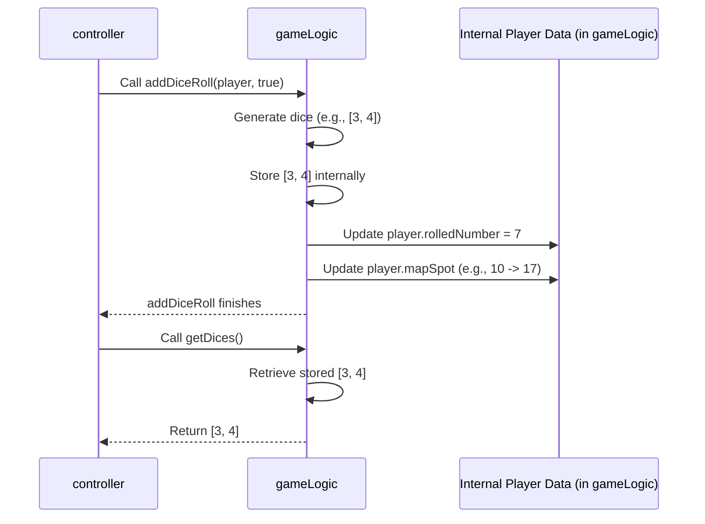

# Chapter 4: Game Logic (`gameLogic`)

Welcome to Chapter 4! In [Chapter 3: Game Orchestrator (`controller`)](03_game_orchestrator___controller___.md), we saw how the `controller` acts like a movie director, coordinating the game's flow. It listens to button clicks, tells the game what to do, and instructs the [UI Controller (`UIController`)](02_ui_controller___uicontroller___.md) to update the screen.

But where do the actual *rules* of Monopoly live? When the `controller` says "Roll the dice!", who actually calculates the random numbers? When a player lands on a property, who knows how much rent is owed, or if it's even owned by someone? This is the job of the **Game Logic** module, which we call `gameLogic` in our code.

## What's the Big Idea? The Rulebook and Scorekeeper!

Imagine you're playing a physical board game. You have:
1.  The board, pieces, and dice (like our HTML/CSS visuals).
2.  Someone moving the pieces and showing the dice (like our `UIController`).
3.  Someone deciding whose turn it is and managing the game flow (like our `controller`).
4.  But you also need a **Rulebook** to know *how* to play, and a **Banker/Scorekeeper** to track money and property ownership.

The `gameLogic` module is both the **Rulebook** and the **Banker/Scorekeeper** for our digital Monopoly game.

Its main jobs are:
*   **Holding Game State:** It keeps track of all the important information:
    *   Who the players are.
    *   How much money each player has.
    *   Which properties each player owns.
    *   Where each player is on the board (`mapSpot`).
    *   Whose turn it currently is (though the `controller` manages the flow *between* turns).
    *   The results of the last dice roll.
*   **Enforcing Rules:** It contains the functions that implement the rules of Monopoly:
    *   Calculating random dice rolls.
    *   Calculating how much rent is owed.
    *   Checking if a player passes "Go" and giving them money.
    *   Managing buying and selling properties.
    *   Handling Chance and Community Chest cards.

Crucially, `gameLogic` **doesn't** directly change anything the user sees on the screen. It works purely with data and rules behind the scenes. It tells the `controller` *what* happened (e.g., "Player 1 rolled a 7 and landed on spot 15"), but it's the `controller`'s job to then tell the `UIController` to *show* that on the screen.

**Our Goal:** Understand how `gameLogic` handles a core game mechanic: rolling the dice and updating the player's position *in the game's data*.

## Key Concepts: Inside the Rulebook

### 1. Game State: Remembering Everything

The `gameLogic` module needs to store information about the current game. This is called the "state". Think of it like the banker's ledger and property deeds all in one place. This includes:

*   An array (`players`) holding data for each player (like their ID, name, money, current board spot `mapSpot`, properties owned).
*   An array (`dices`) holding the result of the last dice roll (e.g., `[4, 2]`).
*   An array (`bankProperties`) holding properties currently owned by the bank.
*   Variables for Chance cards, Community Chest cards, etc.

This state is constantly updated as the game progresses.

### 2. Rules Engine: Applying the Logic

`gameLogic` contains functions that represent the game's rules. When the `controller` asks `gameLogic` to perform an action, these functions run:

*   `addDiceRoll()`: Calculates random dice numbers, updates the player's stored position (`mapSpot`).
*   `updateBudget()`: Changes a player's money amount in the stored data.
*   `changeSpot()`: Directly moves a player to a specific spot (like for a Chance card).
*   Functions to check property ownership, calculate rent, manage auctions, etc.

### 3. Data Model: Organizing Player Info

How does `gameLogic` store information about each player? It uses a blueprint, called a **Constructor Function** (named `Player`), to create consistent objects for each player. Each player object holds properties like `id`, `name`, `budget`, `mapSpot`, `properties`, etc. We'll look closely at this blueprint in [Chapter 5: Player Data Model (`Player` constructor)](05_player_data_model___player__constructor__.md). For now, just know that `gameLogic` uses these objects to keep player data organized.

## Example Use Case: Rolling the Dice (Behind the Scenes)

Let's revisit the "Roll Dice" action from Chapter 3, but focus on what happens inside `gameLogic`.

1.  **`controller` asks `gameLogic`:** The `controller`, triggered by the button click, calls a function in `gameLogic`, say `gameLogic.addDiceRoll(currentPlayer, true)`. It passes in the object representing the current player (`currentPlayer`) and a flag (`true`) indicating the main game is active.

2.  **`gameLogic.addDiceRoll` runs:**

    ```javascript
    // Inside script.js, within the gameLogic module (Simplified)

    addDiceRoll: function(player, gameIsActive) {
      // 1. Calculate two random dice numbers (1-6)
      var dice1 = Math.floor(Math.random() * 6) + 1;
      var dice2 = Math.floor(Math.random() * 6) + 1;

      // 2. Store the result in gameLogic's state
      // (Assuming 'dices' is an array defined within gameLogic)
      dices = [dice1, dice2];
      console.log('gameLogic: Rolled', dices);

      // 3. Update the player object's rolled number property
      player.rolledNumber = dice1 + dice2;

      // 4. If the main game is active, update player's position
      if (gameIsActive) {
        console.log('gameLogic: Player', player.id, 'was at spot', player.mapSpot);
        player.mapSpot += dice1 + dice2; // Add roll to current spot

        // Handle passing Go (Simplified: wrap around 40 squares)
        if (player.mapSpot > 40) {
          player.mapSpot -= 40;
          // TODO: Add logic here to give $200 (using updateBudget)
          console.log('gameLogic: Player passed Go!');
        }
        console.log('gameLogic: Player', player.id, 'is now at spot', player.mapSpot);
      }
      // Note: This function doesn't explicitly return anything here.
      // It modifies the 'player' object and the internal 'dices' state directly.
    },
    ```

    *   **Input:** `player` (an object with properties like `.id`, `.mapSpot`), `gameIsActive` (boolean `true`).
    *   **Processing:**
        *   Generates two random numbers (e.g., `dice1 = 3`, `dice2 = 4`).
        *   Stores `[3, 4]` in the internal `dices` variable.
        *   Updates the `player` object's `rolledNumber` property to `7`.
        *   Updates the `player` object's `mapSpot` property by adding 7 (and handles wrapping past 40).
    *   **Output:** No direct return value, but the internal state (`dices`) and the passed-in `player` object are modified.

3.  **`controller` asks for the result:** After calling `addDiceRoll`, the `controller` needs to know the dice numbers to show them on screen. It calls `gameLogic.getDices()`.

    ```javascript
    // Inside script.js, within the gameLogic module (Simplified)

    getDices: function() {
      // Simply return the currently stored dice roll
      return dices; // e.g., returns [3, 4]
    },
    ```

    *   **Input:** None.
    *   **Processing:** Accesses the internal `dices` variable.
    *   **Output:** The array containing the last dice roll (e.g., `[3, 4]`).

Now the `controller` has the dice result (`[3, 4]`) and knows the player object (`currentPlayer`) has been updated with the new `mapSpot`. It can then tell the `UIController` to display the dice and move the player's token visually.

## How it Works Under the Hood

Let's trace the interaction between `controller` and `gameLogic` for a dice roll:

1.  **Trigger:** Player clicks "Roll Dice".
2.  **`controller`:** The event listener runs `ctrlRollDice`.
3.  **`controller` -> `gameLogic`:** Calls `gameLogic.addDiceRoll(currentPlayer, true)`.
4.  **`gameLogic` (Inside `addDiceRoll`):**
    *   Calculates random numbers (e.g., 3 and 4).
    *   Stores `[3, 4]` in its internal `dices` state.
    *   Updates `currentPlayer.rolledNumber` to 7.
    *   Updates `currentPlayer.mapSpot` based on the roll (e.g., moves from 10 to 17).
    *   (Checks for passing Go, etc.)
5.  **`gameLogic` -> `controller`:** `addDiceRoll` finishes (no direct return value needed here).
6.  **`controller` -> `gameLogic`:** Calls `gameLogic.getDices()`.
7.  **`gameLogic` (Inside `getDices`):** Returns the stored `dices` array (`[3, 4]`).
8.  **`gameLogic` -> `controller`:** Returns `[3, 4]`.
9.  **`controller`:** Now has the dice result `[3, 4]` and the updated `currentPlayer` object. It proceeds to call `UIController` methods.

Here's a sequence diagram:



This shows `gameLogic` managing its internal state (`dices` and `PlayerData`) based on the rules, and providing information back to the `controller` when asked.

## Code Dive: Finding `gameLogic` in `script.js`

The `gameLogic` module is defined near the beginning of `script.js`, using the Module Pattern (an IIFE) like the other modules.

```javascript
// Part of script.js

var gameLogic = (function() {

  // --- Private Data (Game State) ---
  var players = []; // Array to hold all player objects
  var dices = []; // Holds the last dice roll, e.g., [3, 4]
  var bankProperties = []; // Array of property objects owned by the bank
  var chances = []; // Array of chance card objects
  var communityChests = []; // Array of community chest objects
  var parkingMoney = 0; // Money accumulated in Free Parking
  // ... other state variables ...

  // --- Player Data Blueprint (Constructor) ---
  // (Covered in detail in Chapter 5)
  var Player = function(id, name, char, budget, mapSpot, rolledNumber, inJail, properties) {
    this.id = id;
    this.name = name;
    this.char = char;
    this.budget = budget; // Player's money
    this.mapSpot = mapSpot; // Player's position (square ID 1-40)
    this.rolledNumber = rolledNumber; // Sum of last dice roll
    this.inJail = inJail; // Turns left in jail (0 if not in jail)
    this.properties = properties; // Array of property objects owned
  };

  // --- Private Helper Function ---
  // (Example: Function to set up initial game data like properties, cards)
  var makeData = function() {
    // ... logic to create initial property objects and put them in bankProperties ...
    // ... logic to create and shuffle chance/community chest cards ...
    console.log('gameLogic: Initial game data created.');
    parkingMoney = 0; // Reset parking money
  };

  // Initialize data when the module loads
  makeData();

  // --- Public Methods (Rules Engine & Data Access) ---
  return {

    // Adds a new player to the game state
    addPlayer: function(id, name, char) {
      // Creates a new player object using the Player constructor
      var newPlayer = new Player(id, name, char, 600, 21, 0, 0, []); // Start budget $600, spot 21 (GO), 0 roll, 0 jail, empty properties
      players.unshift(newPlayer); // Adds the new player to the players array
      console.log('gameLogic: Added player', players);
    },

    // Handles dice rolling and player movement (Simplified)
    addDiceRoll: function(player, gameIsActive) {
      var dice1 = Math.floor(Math.random() * 6) + 1;
      var dice2 = Math.floor(Math.random() * 6) + 1;
      dices = [dice1, dice2];
      player.rolledNumber = dice1 + dice2;

      if (gameIsActive) {
        var oldSpot = player.mapSpot; // Remember spot before moving
        player.mapSpot += dice1 + dice2;
        if (player.mapSpot > 40) {
           player.mapSpot -= 40;
           // Pass Go check: If the new spot is past 21 (Go) AND the old spot was before 21
           if (player.mapSpot >= 21 && oldSpot < 21) {
             console.log('gameLogic: Player passed Go, adding $200');
             this.updateBudget(player, 200, '+'); // Call own updateBudget function
           }
        }
      }
    },

    // Returns the last dice roll result
    getDices: function() {
      return dices;
    },

    // Returns the array of player objects
    getPlayers: function() {
      return players;
    },

    // Updates a player's budget (Simplified)
    updateBudget: function(player, moneyDiff, sign) {
      if (sign == '+') {
        player.budget += moneyDiff;
      } else {
        player.budget -= moneyDiff;
      }
      console.log('gameLogic: Updated player', player.id, 'budget to', player.budget);
    },

    // Moves a player directly to a spot (e.g., for Go To Jail)
    changeSpot: function(player, id){
        // Example logic based on Chance/Community Chest card effects
        if (id === 6) { // Go directly to Jail
            player.mapSpot = 31; // Jail spot ID
            player.inJail = 3; // Set turns in jail
            console.log('gameLogic: Player sent to jail');
        }
        // ... other cases for different cards ...
    },

    // Clears all game data for a new game
    clearGame: function() {
      players = [];
      dices = [];
      // ... reset other state variables ...
      makeData(); // Re-initialize properties, cards etc.
      console.log('gameLogic: Game data cleared.');
    }

    // ... many other functions for property management, rent, auctions, etc. ...
  };

})(); // Execute the IIFE immediately
```

This code snippet shows:
*   The `gameLogic` module containing private state variables (`players`, `dices`, `bankProperties`).
*   The `Player` constructor function (the blueprint for player data).
*   The `makeData` function to set up initial state.
*   Public functions (`addPlayer`, `addDiceRoll`, `getDices`, `getPlayers`, `updateBudget`, `changeSpot`, `clearGame`) that the `controller` can call to interact with the game state and rules.

## Connecting the Dots

We now have a clearer picture of how the core modules work together:

1.  **[Visual Layout & Styling (HTML/CSS)](01_visual_layout___styling__html_css__.md):** Defines the look of the game board and UI elements.
2.  **[UI Controller (`UIController`)](02_ui_controller___uicontroller___.md):** Updates the visual elements on the screen (moves tokens, shows dice, changes text). Knows *how* to show things.
3.  **[Game Orchestrator (`controller`)](03_game_orchestrator___controller___.md):** Directs the game flow. Listens to user input, tells `gameLogic` what rule to apply, gets the result, and tells `UIController` what to display. Knows *when* things should happen.
4.  **Game Logic (`gameLogic`) (This Chapter):** Stores the game state (player data, properties, money) and enforces the rules (calculates rolls, rent, etc.). Knows *what* the rules are and *what* the current state is.

The `gameLogic` acts as the central "brain" or "source of truth" for the game's data and rules, ensuring everything happens according to the principles of Monopoly.

## What's Next?

We've seen that `gameLogic` relies heavily on structured data, especially for keeping track of each player's information (money, position, properties). How exactly is this player data organized? In the next chapter, we'll zoom in on the blueprint used to create player objects: [Chapter 5: Player Data Model (`Player` constructor)](05_player_data_model___player__constructor__.md). We'll explore how this simple but important structure helps keep our game data consistent and manageable.

---

Generated by [AI Codebase Knowledge Builder](https://github.com/The-Pocket/Tutorial-Codebase-Knowledge)