# Chapter 5: Player Data Model (`Player` constructor)

Welcome to Chapter 5! In [Chapter 4: Game Logic (`gameLogic`)](04_game_logic___gamelogic___.md), we saw how `gameLogic` acts as the rulebook and scorekeeper, managing all the game's important information. A big part of that information is tracking everything about each player – their name, how much money they have, where they are on the board, and more.

But how do we keep all that player information organized and consistent? Imagine trying to remember details for 8 different players! We need a structured way to store this data.

## What's the Big Idea? A Blueprint for Players!

Think about creating characters for a game. Each character needs a name, maybe some health points, an inventory, etc. You'd probably use a **character sheet** – a pre-defined template – to make sure you record the same *types* of information for every character.

In our Monopoly game, the **`Player` constructor** acts like that character sheet or a **blueprint**. It defines *exactly* what information we need to store for every single player:

*   A unique ID
*   Their chosen name
*   The character piece they selected (like '🚀' or '🎩')
*   Their current money (`budget`)
*   Their current position on the board (`mapSpot`)
*   The number they last rolled (`rolledNumber`)
*   Whether they are in jail (`inJail`) and for how long
*   A list of properties they own (`properties`)

Every time a new player joins the game, we use this `Player` blueprint to create a neat package (an "object" in JavaScript) holding all their specific details. This ensures every player object has the same structure, making it much easier for our `gameLogic` to manage them.

**Our Goal:** Understand what a constructor function is and how the `Player` constructor helps us create consistent data structures for each player in the game.

## Key Concepts: Building Blocks for Player Data

### 1. JavaScript Objects: Storing Related Data

In JavaScript, we often group related pieces of information together using **objects**. An object is like a container holding key-value pairs. For example, a simple player object might look like this:

```javascript
{
  name: "Alice",
  budget: 600,
  mapSpot: 21 // Starting at 'GO'
}
```

Here, `name`, `budget`, and `mapSpot` are the *keys* (or properties), and `"Alice"`, `600`, and `21` are their corresponding *values*.

### 2. The Problem: Keeping Things Consistent

Imagine we have 4 players. If we create each player object manually, we might make mistakes:

```javascript
// Player 1 - Looks okay
var player1 = { name: "Alice", budget: 600, mapSpot: 21, properties: [] };

// Player 2 - Uh oh, misspelled 'budget' and forgot 'properties'
var player2 = { name: "Bob", budjet: 600, mapSpot: 21 };

// Player 3 - Added an extra 'score' property we don't use
var player3 = { name: "Charlie", budget: 600, mapSpot: 21, properties: [], score: 0 };
```

This inconsistency makes our code hard to write and prone to errors. How can `gameLogic` reliably update a player's money if the property is sometimes called `budget` and sometimes `budjet`?

### 3. Constructor Functions: The Blueprint Solution

A **constructor function** is a special function in JavaScript used as a template or blueprint for creating objects. By convention, their names start with a capital letter (like `Player`).

Think of it like a **cookie cutter**. You define the shape (the properties) once in the constructor function. Then, every time you use the `new` keyword with that constructor, you get a perfectly shaped cookie (an object) with all the defined properties.

Inside a constructor function, we use the keyword `this`. When creating a new object, `this` refers to the **new object being built**. We use it to attach the properties defined in our blueprint to that specific object.

## Example Use Case: Adding a New Player

Let's see how the `gameLogic` module uses the `Player` constructor when a new player joins. Remember from [Chapter 4: Game Logic (`gameLogic`)](04_game_logic___gamelogic___.md), `gameLogic` has an `addPlayer` function.

```javascript
// Inside gameLogic module (Simplified)

// --- The Player Blueprint (Constructor Function) ---
var Player = function(id, name, char, budget, mapSpot, rolledNumber, inJail, properties) {
  // 'this' refers to the new empty object being created
  this.id = id;                 // Assign the passed 'id' to the new object's 'id' property
  this.name = name;             // Assign the passed 'name'
  this.char = char;             // Assign the chosen character symbol
  this.budget = budget;           // Assign the starting budget
  this.mapSpot = mapSpot;         // Assign the starting board position
  this.rolledNumber = rolledNumber; // Assign the initial rolled number (usually 0)
  this.inJail = inJail;           // Assign initial jail status (usually 0)
  this.properties = properties;     // Assign an empty list for properties
};

// --- Function to add a player to the game ---
addPlayer: function(id, name, char) {
  // Use the 'new' keyword with the Player constructor to create a player object
  var newPlayer = new Player(
    id,       // Player's unique ID
    name,     // Player's chosen name
    char,     // Player's chosen character symbol
    600,      // Starting budget ($600)
    21,       // Starting spot (GO, which is ID 21 in this project)
    0,        // Initial rolled number
    0,        // Not in jail (0 turns)
    []        // Starts with an empty array of properties
  );

  // Now, 'newPlayer' is an object built according to the Player blueprint!
  console.log('Created player object:', newPlayer);

  // Add this new player object to our list of players
  // (Code for adding to the 'players' array goes here)
},
```

**Explanation:**

1.  **`var Player = function(...) {...}`**: This defines our blueprint. It lists all the properties (`id`, `name`, `budget`, etc.) that *every* player object should have.
2.  **`addPlayer: function(id, name, char)`**: This function is called when we need to add a player. It receives the specific details for *this* player (their ID, chosen name, and character).
3.  **`new Player(...)`**: This is the key part!
    *   The `new` keyword tells JavaScript: "We want to create a new object using the `Player` blueprint."
    *   It automatically creates a blank object `{}`.
    *   It runs the `Player` function, setting `this` inside that function to point to the new blank object.
    *   It passes the arguments (`id`, `name`, `char`, `600`, `21`, etc.) to the `Player` function.
    *   Inside the `Player` function, lines like `this.id = id;` add properties to the new object.
    *   Finally, `new` returns the fully constructed object.
4.  **`var newPlayer = ...`**: The newly created, fully populated player object is stored in the `newPlayer` variable.

**Input:** `gameLogic.addPlayer(1, 'Alice', '🚀')`

**Output (Console Log):**

```
Created player object: {
  id: 1,
  name: "Alice",
  char: "🚀",
  budget: 600,
  mapSpot: 21,
  rolledNumber: 0,
  inJail: 0,
  properties: []
}
```

See? We got a perfectly structured object for Alice, ready to be used by the game! If we call `addPlayer` again for Bob, he will also get an object with the exact same set of properties, just different values.

## How it Works Under the Hood

What happens internally when `new Player(...)` is executed?

1.  **Create Object:** JavaScript creates a brand new, empty object: `{}`.
2.  **Link `this`:** JavaScript sets the `this` keyword *inside* the `Player` constructor function to point to this new empty object.
3.  **Execute Constructor:** The code inside the `Player` function runs. Each line like `this.id = id;`, `this.name = name;`, etc., adds a property to the new object (the one `this` is pointing to).
4.  **Return Object:** The `new` keyword automatically returns the newly created and populated object.

Here's a simple diagram showing the process when `gameLogic` calls `addPlayer`:

```mermaid
sequenceDiagram
    participant GL as gameLogic.addPlayer
    participant NewOp as new Player(...)
    participant PlayerConst as Player Constructor Code
    participant PlayerObj as New Player Object

    GL->>NewOp: Calls 'new Player(1, "Alice", "🚀", 600, ...)'
    NewOp->>PlayerObj: 1. Creates an empty object {}
    NewOp->>PlayerConst: 2. Runs constructor code, 'this' points to PlayerObj
    PlayerConst->>PlayerObj: 3. Adds properties (this.id = 1, this.name = "Alice", ...)
    PlayerConst-->>NewOp: (Constructor finishes)
    NewOp-->>GL: 4. Returns the fully populated PlayerObj
    Note over GL: 'newPlayer' variable now holds the PlayerObj
```



## Code Dive: The `Player` Constructor in `script.js`

Let's look at the actual `Player` constructor function defined inside the `gameLogic` module in `script.js`:

```javascript
// --- Inside the gameLogic module in script.js ---

// Function constructor (Blueprint for Player objects)
// Using Classical Inheritance style (ES5). Modern JS (ES6+) often uses 'class'.
var Player = function(id, name, char, budget, mapSpot, rolledNumber, inJail, properties) {
  this.id = id;                 // Unique identifier for the player (e.g., 1, 2, 3...)
  this.name = name;             // Player's entered name (e.g., "Alice")
  this.char = char;             // HTML entity for the chosen character (e.g., '🚀')
  this.budget = budget;           // Current amount of money the player has
  this.mapSpot = mapSpot;         // ID of the board square the player is on (1-40)
  this.rolledNumber = rolledNumber; // Sum of the player's last dice roll
  this.inJail = inJail;           // Number of turns remaining in jail (0 if not in jail)
  this.properties = properties;     // An array to hold property objects owned by the player
}

// --- Example of its use within gameLogic.addPlayer ---
addPlayer: function(id, name, char) {
  // Use the constructor to create a consistent player object
  var newPlayer = new Player(id, name, char, 600, 21, 0, 0, []);
  // Add this player object to the game's list of players
  players.unshift(newPlayer); // 'players' is an array holding all player objects
  console.log(players);
},
```

This code directly shows the blueprint. Every time `gameLogic` needs to represent a player, it uses `new Player(...)` with the appropriate starting values, ensuring every player starts with the same set of characteristics tracked in the same way.

## Connecting the Dots

The `Player` constructor is a fundamental building block *used by* the [Game Logic (`gameLogic`)](04_game_logic___gamelogic___.md).

*   `gameLogic` *uses* the `Player` constructor to create and store data about each participant.
*   It then *manipulates* these player objects according to the game rules (e.g., changing `player.budget` or `player.mapSpot`).
*   The [Game Orchestrator (`controller`)](03_game_orchestrator___controller___.md) gets these player objects from `gameLogic`.
*   The `controller` passes relevant player data (like `player.mapSpot` or `player.budget`) to the [UI Controller (`UIController`)](02_ui_controller___uicontroller___.md) to update the screen.

This constructor provides the consistent data structure that the rest of the game relies on to function correctly.

## What's Next?

We've seen how the `Player` constructor provides a blueprint for storing player data, including an empty `properties` array. But what about the properties themselves? How do we represent Park Place or Boardwalk, including their cost, rent, and owner?

That leads us to the next chapter, [Property Management](06_property_management_.md). We'll explore how the game defines, tracks, and manages all the different properties on the Monopoly board.

---

Generated by [AI Codebase Knowledge Builder](https://github.com/The-Pocket/Tutorial-Codebase-Knowledge)