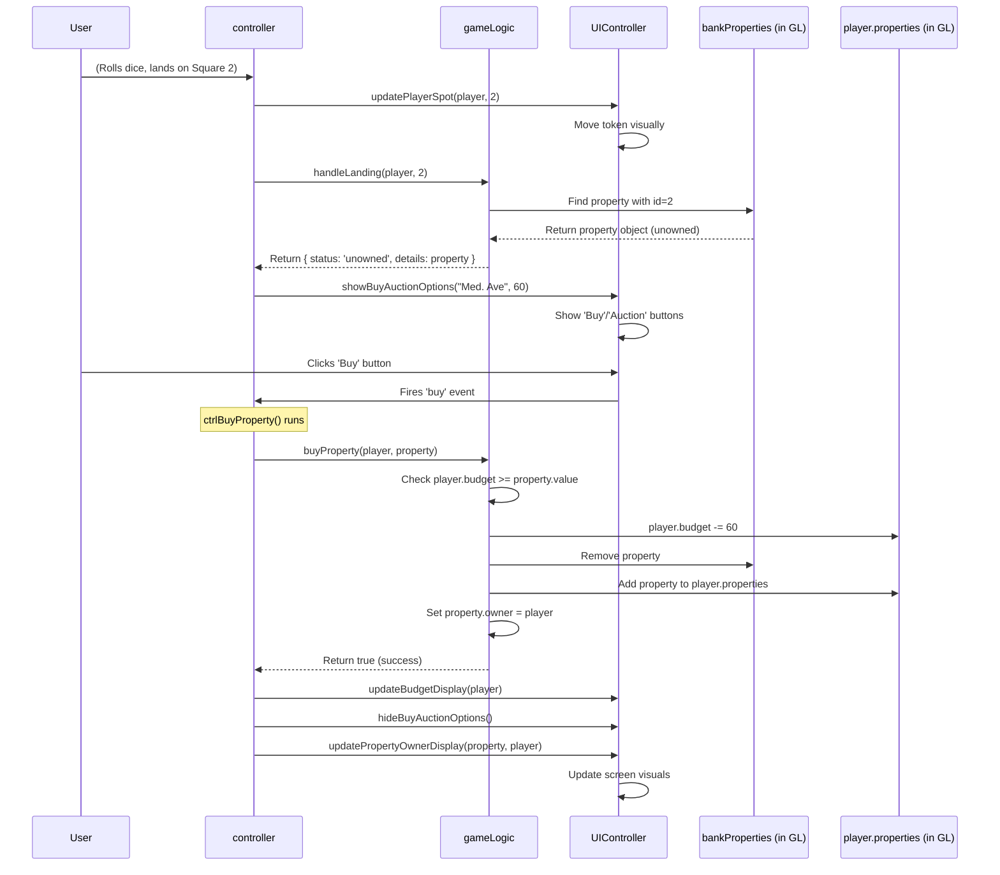

# Chapter 6: Property Management

Welcome to Chapter 6! In [Chapter 5: Player Data Model (`Player` constructor)](05_player_data_model___player__constructor__.md), we saw how each player object has a blueprint, including an empty `properties` array to hold the properties they own.

But what about the properties themselves? How does the game know that 'Boardwalk' costs $400 and 'Mediterranean Avenue' costs $60? How does it track who owns what, calculate rent, and handle buying or auctioning? That's the job of the **Property Management** system, which mostly lives inside our [Game Logic (`gameLogic`)](04_game_logic___gamelogic___.md).

## What's the Big Idea? Being the Game's Real Estate Agent!

Imagine you're the Monopoly Banker *and* the official Land Registry rolled into one. You have a list of all the properties on the board, know their prices, their rent potential, and crucially, who owns them (the bank or a player).

The **Property Management** system handles all this:

1.  **Knowing the Properties:** It stores the details for every property (name, cost, rent, color group, etc.).
2.  **Tracking Ownership:** It knows which properties are currently unowned (belong to the bank) and which belong to specific players.
3.  **Handling Transactions:** It manages the logic for buying properties, calculating and collecting rent, and even adding houses/hotels (though we'll keep it simple here).

It's the central database and rule enforcer for all the real estate in the game.

**Our Goal:** Understand how the game represents properties and how it handles the basic scenario of a player landing on an unowned property, like 'Mediterranean Avenue', offering them the chance to buy it.

## Key Concepts: Managing the Deeds

### 1. Representing a Property: The Deed Card Data

Just like we have a `Player` blueprint, we need a way to store information about each property. We can use simple JavaScript objects for this. Each property object needs to hold details like:

*   `id`: The unique ID of the board square (e.g., `2` for Mediterranean Avenue).
*   `title`: The name (e.g., `"Mediterranean Avenue"`).
*   `value`: The cost to buy it (e.g., `60`).
*   `owner`: Who currently owns it (initially `null` or linked to the 'bank', later to a player object).
*   `rent`: How much rent costs (this can be simple or complex with houses).

Inside `gameLogic`, there's likely an array holding all these property objects.

```javascript
// Simplified example of how a property might be represented
var mediterraneanAve = {
  id: 2,
  title: "Mediterranean Avenue",
  value: 60,
  rent: 2, // Basic rent
  owner: null // Starts unowned
  // ... other details like color group, house costs etc.
};
```

### 2. Tracking Ownership: Bank vs. Players

The `gameLogic` needs to know which properties are available and which are owned. A common way is:

*   Have a main list/array of *all* properties (`allProperties`).
*   Have an array of properties currently owned by the bank (`bankProperties`).
*   Each player object, created using the [Player constructor](05_player_data_model___player__constructor__.md), has its own `properties` array (`player.properties`).

When a player buys a property, the system removes it from `bankProperties` and adds it to that `player.properties` array.

### 3. Core Actions: Buy, Rent, Check

The Property Management system (within `gameLogic`) provides functions to:

*   **`checkPropertyStatus(squareId)`:** When a player lands on a square, this function looks up the property associated with that `squareId`. It checks if it's owned, unowned, or not a property at all (like 'Go' or 'Jail').
*   **`buyProperty(player, property)`:** If a player decides to buy an unowned property, this function handles the transaction:
    *   Subtracts the cost (`property.value`) from `player.budget`.
    *   Removes the `property` from `bankProperties`.
    *   Adds the `property` to `player.properties`.
    *   Updates the `property.owner` to point to the `player`.
*   **`calculateRent(property)`:** Determines how much rent is due based on the property's rules (and potentially houses/hotels or monopolies).

## Example Use Case: Landing on Unowned 'Mediterranean Avenue'

Let's trace the steps when Player 1 (Alice) lands on square `2` ('Mediterranean Avenue'), which is currently unowned.

1.  **Player Moves:** Alice rolls the dice, the [Game Logic (`gameLogic`)](04_game_logic___gamelogic___.md) updates her `mapSpot` to `2`. The [Game Orchestrator (`controller`)](03_game_orchestrator___controller___.md) tells the [UI Controller (`UIController`)](02_ui_controller___uicontroller___.md) to visually move her token.
2.  **`controller` Asks `gameLogic`:** The `controller` needs to know what happens on square `2`. It calls a function like `gameLogic.handleLanding(player1, 2)`.
3.  **`gameLogic.handleLanding` Runs:**
    *   It calls its internal property management function, maybe `checkPropertyStatus(2)`.
    *   `checkPropertyStatus` finds the 'Mediterranean Avenue' property object.
    *   It checks if this property object exists in the `bankProperties` array. Yes, it does!
    *   It determines the status is "unowned property".
    *   `handleLanding` returns this status (and maybe the property details like cost) back to the `controller`.

    ```javascript
    // Simplified concept within gameLogic

    handleLanding: function(player, squareId) {
      console.log('gameLogic: Handling landing on square', squareId);

      // Is this square a property? Look it up in bankProperties
      var property = bankProperties.find(prop => prop.id === squareId);

      if (property) {
        // Found it in the bank's list! It's unowned.
        console.log('gameLogic: Square', squareId, 'is an unowned property:', property.title);
        return { status: 'unowned', details: property };
      } else {
        // Check if it's owned by a player...
        // ...or if it's a non-property square (Go, Jail, Chance etc.)
        // (More complex logic here)
        return { status: 'other' };
      }
    },
    ```

4.  **`controller` Reacts:** The `controller` receives the `{ status: 'unowned', details: propertyObject }` result.
    *   It knows this means the player gets buy/auction options.
    *   It calls `UIController.showBuyAuctionOptions(propertyObject.title, propertyObject.value)`.

5.  **`UIController` Shows Options:** The `UIController` updates the screen to display buttons like "Buy Property ($60)" and "Auction".

6.  **Player Chooses (e.g., Buy):** Alice clicks the "Buy Property" button.

7.  **`controller` Handles Buy:**
    *   The button's event listener triggers a `controller` function (e.g., `ctrlBuyProperty`).
    *   `ctrlBuyProperty` calls `gameLogic.buyProperty(player1, propertyObject)`.

8.  **`gameLogic.buyProperty` Executes:**
    *   Checks if `player1.budget` >= `propertyObject.value`. Assume yes.
    *   `player1.budget -= propertyObject.value;` (e.g., 600 - 60 = 540)
    *   Finds `propertyObject` in `bankProperties` and removes it.
    *   Adds `propertyObject` to `player1.properties`.
    *   Sets `propertyObject.owner = player1;`
    *   Returns `true` (success) to the `controller`.

    ```javascript
    // Simplified concept within gameLogic

    buyProperty: function(player, property) {
      if (player.budget >= property.value) {
        player.budget -= property.value;

        // Remove from bank's list
        var index = bankProperties.findIndex(prop => prop.id === property.id);
        if (index > -1) {
          bankProperties.splice(index, 1);
        }

        // Add to player's list
        player.properties.push(property);
        property.owner = player; // Set owner reference

        console.log('gameLogic:', player.name, 'bought', property.title);
        return true; // Success
      } else {
        console.log('gameLogic: Not enough money to buy.');
        return false; // Failed
      }
    },
    ```

9.  **`controller` Updates UI:**
    *   Receives `true` from `gameLogic`.
    *   Calls `UIController.updateBudgetDisplay(player1)` to show $540.
    *   Calls `UIController.hideBuyAuctionOptions()`.
    *   Calls `UIController.updatePropertyOwnerDisplay(propertyObject, player1)` (to maybe show Alice's token on the property card visually).

**Outcome:** Alice now owns Mediterranean Avenue, her budget is reduced, and the game state reflects this change.

## How it Works Under the Hood

Let's visualize the flow when a player lands on an unowned property and decides to buy it:



This shows how `gameLogic` acts as the source of truth for property data and ownership, while the `controller` orchestrates the interaction between the rules (`gameLogic`) and the visuals (`UIController`).

## Code Dive: Properties in `script.js`

Inside `gameLogic`, the properties are set up initially, often in a helper function like `makeData`.

```javascript
// --- Inside the gameLogic module in script.js ---

var bankProperties = []; // Array to hold property objects owned by the bank
var propertyIDs = [];    // Array holding just the IDs of ownable properties

// Blueprint for Property objects (can be simple or complex)
var Property = function(id, title, value, /* rent, group, etc... */ houses, built) {
  this.id = id;
  this.title = title;
  this.value = value;
  this.owner = null; // Initially unowned
  this.houses = houses; // Number of houses built
  this.built = built; // Flag if built on this turn
  // ... rent calculation logic might be a method here or handled elsewhere ...
}

// Helper function to initialize game data (simplified)
var makeData = function() {
  // Clear previous properties if any
  bankProperties = [];

  // Example: Define raw property data
  var initialPropertiesData = [
    // [Title, Value, ID] - Simplified, real code has more detail
    ['Mediterranean Avenue', 60, 2],
    ['Baltic Avenue', 60, 4],
    ['Reading Railroad', 200, 6],
    ['Oriental Avenue', 100, 7],
    // ... all other properties ...
    ['Boardwalk', 400, 20]
  ];

  // List of square IDs that are *not* buyable properties
  var nonPropertyCards = [1, 3, 11, 14, 17, 19, 21, 23, 25, 28, 31, 38];

  // Create Property objects and add them to bankProperties
  // (The original code has a slightly different loop structure, this is conceptual)
  var currentId = 1;
  initialPropertiesData.forEach(propData => {
      // Find the correct ID based on the board layout (skipping non-properties)
      while(nonPropertyCards.includes(currentId) || currentId > 40) {
          currentId++;
          if (currentId == 21) currentId = 22; // Adjust for GO square position
      }
      var newProperty = new Property(currentId, propData[0], propData[1], 0, false);
      bankProperties.push(newProperty);
      currentId++; // Move to the next potential ID
  });

  // Store just the IDs for quick lookups
  propertyIDs = bankProperties.map(prop => prop.id);

  console.log('gameLogic: Initial properties created and stored in bankProperties.');
  // ... setup chance/community chest cards etc. ...
};

// Call makeData when gameLogic module loads
makeData();

// --- Public methods accessible by the controller ---
return {
  // ... other gameLogic functions (addPlayer, addDiceRoll, etc.) ...

  getBankProperties: function() {
    return bankProperties;
  },

  getPropertyIDs: function() {
      return propertyIDs;
  },

  // Simplified check when landing (real code is more complex)
  checkLandingSquare: function(squareId) {
      if (propertyIDs.includes(squareId)) {
          let bankProp = bankProperties.find(p => p.id === squareId);
          if (bankProp) {
              return { status: 'unowned_property', details: bankProp };
          } else {
              // Need to find which player owns it
              let ownerPlayer = null;
              let ownedProp = null;
              players.forEach(player => { // 'players' is the array of Player objects
                  let foundProp = player.properties.find(p => p.id === squareId);
                  if (foundProp) {
                      ownerPlayer = player;
                      ownedProp = foundProp;
                  }
              });
              if (ownerPlayer) {
                  // Calculate rent based on ownedProp details (houses, monopoly etc.)
                  let rent = ownedProp.value / 10; // Very basic rent calculation
                  return { status: 'owned_property', owner: ownerPlayer, rent: rent, details: ownedProp };
              }
          }
      }
      // Handle non-property squares (Chance, Tax, Go, etc.)
      // ...
      return { status: 'other' };
  },

  // Simplified buy function
  buyProperty: function(player, property) {
    if (player.budget >= property.value) {
      player.budget -= property.value;
      var index = bankProperties.findIndex(prop => prop.id === property.id);
      if (index > -1) {
        bankProperties.splice(index, 1); // Remove from bank
        player.properties.push(property); // Add to player
        property.owner = player;          // Set owner
        // Update propertyIDs if necessary (or maybe just filter bankProperties)
        propertyIDs = bankProperties.map(prop => prop.id); // Recreate list of bank-owned IDs
        return true;
      }
    }
    return false;
  }

  // ... function to calculate rent ...
  // ... function to handle auctions ...
  // ... function to add/sell houses (check monopolies etc.) ...
};
```

This snippet shows:
*   How property data might be initially defined and stored in `bankProperties`.
*   A `Property` constructor (though simple objects work too).
*   A simplified `checkLandingSquare` function that identifies if a square is an unowned or owned property.
*   A simplified `buyProperty` function demonstrating the transfer of ownership and budget update.

The actual implementation in `script.js` is more detailed, especially in rent calculation and handling all square types, but the core idea is managing these property objects and their ownership status.

## Connecting the Dots

Property Management is a core part of the [Game Logic (`gameLogic`)](04_game_logic___gamelogic___.md) module.

*   `gameLogic` **holds** the property data and ownership state (`bankProperties`, `player.properties`).
*   `gameLogic` **provides functions** to check property status, buy properties, and calculate rent.
*   The [Game Orchestrator (`controller`)](03_game_orchestrator___controller___.md) **uses** these `gameLogic` functions when a player lands on a square or takes an action (like clicking "Buy").
*   The `controller` then instructs the [UI Controller (`UIController`)](02_ui_controller___uicontroller___.md) to **display** the relevant information (buy/auction buttons, rent messages, updated owner visuals).

This system ensures that the rules around properties are consistently applied throughout the game.

## What's Next?

Now that we understand how individual properties are managed and bought, what happens when players want to exchange properties *among themselves*? How does the game handle offers, counter-offers, and the transfer of properties and money between players?

That's where the **Trading System** comes in. In the next chapter, [Trading System](07_trading_system_.md), we'll explore how players can negotiate and trade assets, adding another layer of strategy to the game.

---

Generated by [AI Codebase Knowledge Builder](https://github.com/The-Pocket/Tutorial-Codebase-Knowledge)