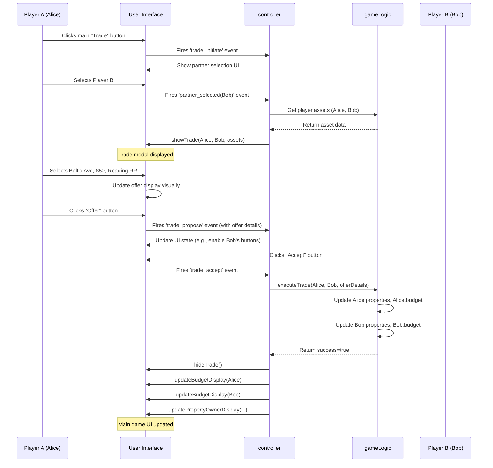

# Chapter 7: Trading System

Welcome to the final chapter of our `monopoly-clone-og` tutorial! In [Chapter 6: Property Management](06_property_management_.md), we saw how the game handles individual properties – knowing their details, tracking who owns them, and managing buying or rent collection via the `gameLogic`.

But Monopoly isn't just about buying from the bank; it's also about making deals with other players! What if you really need 'Boardwalk' to complete your set, and another player owns it but is short on cash? You might want to offer them some money and another property in exchange. How does the game facilitate this negotiation? That's where the **Trading System** comes in.

## What's the Big Idea? A Digital Negotiation Table!

Imagine you want to trade baseball cards with a friend. You wouldn't just shout offers across the room. You'd likely sit down at a table, lay out your cards, see their cards, discuss what you want, and make a specific offer like "I'll give you my rare pitcher card and $5 for your star outfielder card."

The **Trading System** in our game acts like this digital negotiation table. It provides a special interface (a pop-up window or "modal") where two players can:

1.  **See each other's assets:** View the properties and money available for trade for both players involved.
2.  **Select items for an offer:** Choose specific properties and/or an amount of money to include in the proposed deal.
3.  **Propose, Accept, Reject, or Cancel:** Use buttons to manage the negotiation process.

If a trade is agreed upon, the system ensures the actual exchange of properties and money happens correctly behind the scenes, updating both players' inventories.

**Our Goal:** Understand how the Trading System uses the UI (`UIController`, HTML, CSS) to present the negotiation interface and how the logic (`controller`, `gameLogic`) handles the exchange of assets if a deal is made.

## Key Concepts: Making Deals Happen

### 1. The Trading Interface (UI)

When a player decides to trade, they need a dedicated screen. In our project, this is handled by:

*   **HTML (`index.html`):** Defines the structure of the trade pop-up window (`<div class="trade__modal">`). This includes areas to display the current player's assets, the trading partner's assets, and a central area showing the proposed offer and control buttons.
*   **CSS (`style.css`):** Styles this modal, making it look like a distinct overlay (`trade__overlay`, `trade__modal`) and initially hiding it (`display: none;`).
*   **[UI Controller (`UIController`)](02_ui_controller___uicontroller___.md):** Contains functions like `showTrade` and `hideTrade`.
    *   `showTrade`: Makes the trade modal visible (`display: flex;`) and populates it with the current assets of the two players involved (getting this data via the `controller` from `gameLogic`). It might also set up which buttons (Offer, Cancel, Accept, Reject) are initially visible.
    *   `hideTrade`: Hides the modal again (`display: none;`).

### 2. Selecting Assets & Offering

Inside the trade modal UI, players need to interact to build an offer:

*   **Visual Inventory:** The `UIController` displays each player's properties (maybe as small clickable cards) and their current money.
*   **Click to Offer:** A player might click on a property card in their section or the opponent's section to indicate they want to include it in the trade offer. They might also type an amount of money into an input field.
*   **Offer Display:** The UI updates a central "Offer" area to show what items are currently proposed for exchange.

### 3. Negotiation Flow (Simplified)

The [Game Orchestrator (`controller`)](03_game_orchestrator___controller___.md) manages the steps:

1.  **Initiate:** Player A clicks the main "Trade" button on the game board.
2.  **Select Partner:** The `controller` asks the `UIController` to show a list of other players. Player A selects Player B.
3.  **Show Modal:** `controller` tells `UIController` to display the `trade__modal`, populated with Player A's and Player B's assets (fetched from `gameLogic`).
4.  **Build Offer:** Player A interacts with the UI (clicks properties, enters money) to build their side of the offer and what they want in return.
5.  **Propose:** Player A clicks the "Offer" button.
6.  **Review:** The `controller` might then update the UI to clearly present the offer to Player B (or simply enable the "Accept"/"Reject" buttons for Player B).
7.  **Decision:** Player B clicks "Accept", "Reject", or "Cancel".
8.  **Execute/Cancel:**
    *   If "Accept": `controller` tells `gameLogic` to perform the exchange.
    *   If "Reject" or "Cancel": `controller` tells `UIController` to simply close the trade modal.

### 4. Trade Logic (`gameLogic`)

If Player B accepts the trade, the `controller` calls a function in the [Game Logic (`gameLogic`)](04_game_logic___gamelogic___.md), perhaps `executeTrade`. This function is the only part that actually changes the core game data:

*   It takes the details of the agreed-upon trade (which properties and how much money are moving).
*   It modifies the `properties` array inside both player objects (removing traded properties from one and adding them to the other).
*   It adjusts the `budget` property for both player objects.

This ensures the trade is correctly reflected in the game's central state.

## Example Use Case: Trading Properties and Money

Let's trace a simple trade: Player 1 (Alice) wants Player 2's (Bob) 'Reading Railroad'. Alice offers her 'Baltic Avenue' and $50.

1.  **Initiate:** Alice clicks the main "Trade" button.
2.  **Select Partner:** `controller` triggers UI, Alice selects Bob.
3.  **Show Modal:** `controller` calls `UICtrl.showTrade([alice, bob])`. The UI displays the trade window with Alice's assets (including 'Baltic Avenue', budget) and Bob's assets (including 'Reading Railroad', budget).
4.  **Build Offer:**
    *   Alice clicks on her 'Baltic Avenue' card in the UI.
    *   Alice types '50' into the money input field for her offer.
    *   Alice clicks on Bob's 'Reading Railroad' card in the UI.
    *   (The central "Offer" area updates visually: Alice gives Baltic Ave + $50, receives Reading Railroad).
5.  **Propose:** Alice clicks "Offer".
6.  **Review:** `controller` updates the UI state. The "Offer" button might disable, and Bob's "Accept" / "Reject" buttons become active.
7.  **Decision:** Bob reviews the offer and clicks "Accept".
8.  **Execute:**
    *   `controller` receives the "Accept" event and calls `gameLogic.executeTrade(alice, bob, { property: balticAve, money: 50 }, { property: readingRR, money: 0 })`.
    *   **Inside `gameLogic.executeTrade`:**
        *   Remove `balticAve` from `alice.properties`, add `readingRR` to `alice.properties`.
        *   Remove `readingRR` from `bob.properties`, add `balticAve` to `bob.properties`.
        *   `alice.budget -= 50;`
        *   `bob.budget += 50;`
    *   `gameLogic` confirms success to `controller`.
9.  **Finalize UI:**
    *   `controller` calls `UICtrl.hideTrade()`.
    *   `controller` calls `UICtrl.updateBudgetDisplay(alice)` and `UICtrl.updateBudgetDisplay(bob)`.
    *   `controller` calls `UICtrl.updatePropertyOwnerDisplay(...)` for both properties to reflect the new ownership visually on the board/stats panels.

**Outcome:** The trade modal closes. Alice now owns Reading Railroad but lost Baltic Avenue and $50. Bob now owns Baltic Avenue and gained $50. The UI reflects these changes.

## How it Works Under the Hood

Here's a sequence diagram visualizing the trade process:



This diagram shows the `controller` managing the flow between user actions in the UI, fetching data from `gameLogic`, instructing the UI to update, and finally telling `gameLogic` to execute the trade if accepted.

## Code Dive: Implementing the Trading System

Let's look at simplified snippets related to trading.

**HTML (`index.html` - Simplified `trade__modal`):**

```html
<!-- Inside the main map div -->
<span class="trade__overlay"></span> <!-- Dark background overlay -->
<div class="trade__modal"> <!-- The main trade window -->

  <!-- Section for Player 1 (Current Player) -->
  <div class="currentPlayer">
    <h1>Player 1 Name</h1>
    <!-- Player 1's properties will be loaded here dynamically -->
    <div class="player1_properties">
      <!-- e.g., <div class="trade-property" data-prop-id="2">Baltic Ave</div> -->
    </div>
    Money: <input type="number" class="offer_money_p1" value="0">
  </div>

  <!-- Central Offer Area -->
  <div class="offer">
    <h2>TRADE</h2>
    <div class="offer__display">
      <!-- Text describing the current offer -->
      <p>Player 1 offers...</p>
      <p>Player 2 offers...</p>
    </div>
    <div class="offer__buttons">
      <button class="trade-offer-btn">Offer</button>
      <button class="trade-cancel-btn">Cancel</button>
      <button class="trade-accept-btn" style="display:none;">Accept</button>
      <button class="trade-reject-btn" style="display:none;">Reject</button>
    </div>
  </div>

  <!-- Section for Player 2 (Trading Partner) -->
  <div class="tradePlayer">
    <h1>Player 2 Name</h1>
    <!-- Player 2's properties will be loaded here dynamically -->
    <div class="player2_properties">
      <!-- e.g., <div class="trade-property" data-prop-id="6">Reading RR</div> -->
    </div>
    Money: <input type="number" class="offer_money_p2" value="0">
  </div>

</div>
```

*   This HTML defines the basic layout with placeholders for player names, properties, and money inputs. The `UIController` will populate the property sections and manage button visibility.

**CSS (`style.css` - Basic Styling):**

```css
.trade__overlay {
  display: none; /* Hidden by default */
  position: absolute;
  width: 100%;
  height: 100%;
  background-color: rgba(0,0,0,.4); /* Semi-transparent black */
  z-index: 105; /* Above the map */
}

.trade__modal {
  width: 70%;
  height: 70%;
  background-color: rgba(255, 217, 0, 0.8); /* Yellowish, semi-transparent */
  position: absolute;
  top: 50%;
  left: 50%;
  transform: translate(-50%, -50%);
  z-index: 200; /* Above the overlay */
  border-radius: 20px;
  padding: 1rem;
  display: none; /* Hidden by default, changed to 'flex' by JS */
  /* Flexbox properties might be used to arrange currentPlayer, offer, tradePlayer */
}

/* Style for property cards inside the modal */
.trade-property {
  border: 1px solid black;
  padding: 5px;
  margin: 2px;
  cursor: pointer;
  background-color: lightblue;
}
.trade-property.selected-offer { /* Style for selected properties */
  background-color: yellow;
  border: 2px solid red;
}
```

*   This CSS hides the overlay and modal initially. JavaScript (`UIController`) will change `display: none` to `display: flex` (or `block`) to show them. It also includes basic styling for visual feedback when properties are selected for the offer.

**`UIController` (`script.js` - Simplified Trade Functions):**

```javascript
// Inside UIController module

return {
  // ... other UI functions ...

  // Shows the trade modal and populates it (simplified)
  showTrade: function(player1, player2) {
    document.querySelector('.trade__overlay').style.display = 'block';
    document.querySelector('.trade__modal').style.display = 'flex';

    // Populate player names (simplified query selectors)
    document.querySelector('.trade__modal .currentPlayer h1').textContent = player1.name;
    document.querySelector('.trade__modal .tradePlayer h1').textContent = player2.name;

    // Clear previous properties
    document.querySelector('.player1_properties').innerHTML = '';
    document.querySelector('.player2_properties').innerHTML = '';

    // Add Player 1's properties
    player1.properties.forEach(prop => {
      var propHtml = '<div class="trade-property p1" data-prop-id="' + prop.id + '">' + prop.title + '</div>';
      document.querySelector('.player1_properties').insertAdjacentHTML('beforeend', propHtml);
    });

    // Add Player 2's properties
    player2.properties.forEach(prop => {
      var propHtml = '<div class="trade-property p2" data-prop-id="' + prop.id + '">' + prop.title + '</div>';
      document.querySelector('.player2_properties').insertAdjacentHTML('beforeend', propHtml);
    });

    // Reset money inputs
    document.querySelector('.offer_money_p1').value = 0;
    document.querySelector('.offer_money_p2').value = 0;

    // Set initial button visibility
    document.querySelector('.trade-offer-btn').style.display = 'block';
    document.querySelector('.trade-cancel-btn').style.display = 'block';
    document.querySelector('.trade-accept-btn').style.display = 'none';
    document.querySelector('.trade-reject-btn').style.display = 'none';

    // TODO: Add event listeners here or in controller for property clicks/button clicks
  },

  // Hides the trade modal
  hideTrade: function() {
    document.querySelector('.trade__overlay').style.display = 'none';
    document.querySelector('.trade__modal').style.display = 'none';
    // Potentially remove event listeners added in showTrade
  },

  // Updates the visual offer display (conceptual)
  updateTradeOfferUI: function(offerDetails) {
    // Finds the .offer__display element and updates its text
    // to describe what P1 offers and what P2 offers based on offerDetails
    var display = document.querySelector('.offer__display');
    // display.innerHTML = formatOffer(offerDetails); // Example
  },

  // Updates button visibility after an offer is made (conceptual)
  showAcceptRejectButtons: function() {
    document.querySelector('.trade-offer-btn').style.display = 'none';
    // document.querySelector('.trade-cancel-btn').style.display = 'none'; // Maybe keep cancel?
    document.querySelector('.trade-accept-btn').style.display = 'block';
    document.querySelector('.trade-reject-btn').style.display = 'block';
  }

  // ... other UI functions ...
};
```

*   `showTrade` makes the modal visible and dynamically adds the property elements for each player based on their data.
*   `hideTrade` simply hides the modal.
*   Conceptual functions `updateTradeOfferUI` and `showAcceptRejectButtons` illustrate how the UI would respond during negotiation.

**`controller` (`script.js` - Simplified Trade Handling):**

```javascript
// Inside controller module (passing gameLogic as 'game', UIController as 'UICtrl')

// --- Variables to hold current trade state ---
var tradePlayer1 = null;
var tradePlayer2 = null;
var currentOffer = { p1_props: [], p1_money: 0, p2_props: [], p2_money: 0 };

// --- Setup Event Listener for the main Trade button ---
var setupTradeButtonListener = function() {
  document.querySelector('.trade').addEventListener('click', ctrlInitiateTrade);
};

// --- Function to start the trade process ---
var ctrlInitiateTrade = function() {
  console.log('Controller: Trade initiated');
  // In a real game, show player selection UI first. We'll simplify.
  var players = game.getPlayers();
  tradePlayer1 = players[currentPlayer]; // Assume 'currentPlayer' index is tracked
  // For simplicity, let's hardcode trading with the next player
  var partnerIndex = (currentPlayer + 1) % players.length;
  tradePlayer2 = players[partnerIndex];

  if (tradePlayer1 && tradePlayer2 && tradePlayer1 !== tradePlayer2) {
    currentOffer = { p1_props: [], p1_money: 0, p2_props: [], p2_money: 0 }; // Reset offer
    UICtrl.showTrade(tradePlayer1, tradePlayer2);
    // Add listeners for clicks inside the trade modal
    addTradeModalListeners();
  } else {
    console.log('Controller: Not enough players or invalid partner for trade.');
  }
};

// --- Add listeners for buttons/properties inside the modal ---
var addTradeModalListeners = function() {
  // Listener for clicking properties (simplified)
  document.querySelector('.trade__modal').addEventListener('click', function(event) {
    if (event.target.classList.contains('trade-property')) {
      handlePropertyClick(event.target);
    }
  });

  // Listener for Offer button
  document.querySelector('.trade-offer-btn').onclick = ctrlProposeTrade; // Use onclick for simplicity here
  // Listener for Cancel button
  document.querySelector('.trade-cancel-btn').onclick = ctrlCancelTrade;
  // Listener for Accept button
  document.querySelector('.trade-accept-btn').onclick = ctrlAcceptTrade;
  // Listener for Reject button
  document.querySelector('.trade-reject-btn').onclick = ctrlRejectTrade;
};

// --- Handle clicking a property in the trade modal ---
var handlePropertyClick = function(propertyElement) {
    var propId = parseInt(propertyElement.getAttribute('data-prop-id'));
    propertyElement.classList.toggle('selected-offer'); // Visual toggle

    // Update the currentOffer object based on which player's property was clicked
    if (propertyElement.classList.contains('p1')) {
        // Add/remove from player 1's offer list
        updateOfferList(currentOffer.p1_props, propId);
    } else if (propertyElement.classList.contains('p2')) {
        // Add/remove from player 2's request list
        updateOfferList(currentOffer.p2_props, propId);
    }
    UICtrl.updateTradeOfferUI(currentOffer); // Update visual display
};

// Helper to add/remove from offer list
var updateOfferList = function(list, id) {
    var index = list.indexOf(id);
    if (index > -1) list.splice(index, 1); // Remove if exists
    else list.push(id); // Add if doesn't exist
};

// --- Function when "Offer" is clicked ---
var ctrlProposeTrade = function() {
  console.log('Controller: Trade proposed');
  // Get money amounts from input fields
  currentOffer.p1_money = parseInt(document.querySelector('.offer_money_p1').value) || 0;
  currentOffer.p2_money = parseInt(document.querySelector('.offer_money_p2').value) || 0;

  // Validate the offer (e.g., enough money?) - Skipped for simplicity

  UICtrl.updateTradeOfferUI(currentOffer); // Show final offer
  UICtrl.showAcceptRejectButtons(); // Switch button visibility
};

// --- Function when "Accept" is clicked ---
var ctrlAcceptTrade = function() {
  console.log('Controller: Trade accepted');
  // Tell gameLogic to execute the trade
  var success = game.executeTrade(tradePlayer1, tradePlayer2, currentOffer);

  if (success) {
    console.log('Controller: Trade executed successfully in gameLogic.');
    // Update UI (budgets, property ownership visuals)
    UICtrl.updateBudgetDisplay(tradePlayer1); // Assume this function exists
    UICtrl.updateBudgetDisplay(tradePlayer2);
    // Need more complex UI update for property cards/stats
    // UICtrl.updatePropertyOwnerDisplay(...);
  } else {
    console.log('Controller: Trade failed validation in gameLogic.');
    // Optionally show an error message to the user
  }
  UICtrl.hideTrade(); // Close the modal
};

// --- Functions for Cancel/Reject ---
var ctrlCancelTrade = function() {
  console.log('Controller: Trade cancelled');
  UICtrl.hideTrade();
};
var ctrlRejectTrade = function() {
  console.log('Controller: Trade rejected');
  UICtrl.hideTrade();
};

// Make sure to call setupTradeButtonListener in the main init function
// init: function() { /* ... */ setupTradeButtonListener(); /* ... */ }
```

*   The `controller` manages the state of the trade (who is trading, what the offer is).
*   It listens for the main "Trade" button click (`ctrlInitiateTrade`).
*   It calls `UICtrl.showTrade` and adds listeners for actions *within* the modal.
*   It handles clicks on properties and buttons, updating the `currentOffer` object.
*   If "Accept" is clicked, it calls `game.executeTrade` and then updates the main UI via `UICtrl`.

**`gameLogic` (`script.js` - Simplified Trade Execution):**

```javascript
// Inside gameLogic module

return {
  // ... other gameLogic functions ...

  // Executes the agreed-upon trade
  executeTrade: function(player1, player2, offer) {
    console.log('gameLogic: Attempting to execute trade:', player1.name, player2.name, offer);

    // --- 1. Validate the trade (Basic Checks) ---
    // Does player1 have enough money?
    if (player1.budget < offer.p1_money) {
        console.error('gameLogic: Player 1 cannot afford trade.');
        return false;
    }
    // Does player2 have enough money?
    if (player2.budget < offer.p2_money) {
        console.error('gameLogic: Player 2 cannot afford trade.');
        return false;
    }
    // Does player1 own the properties they are offering?
    for (const propId of offer.p1_props) {
        if (!player1.properties.some(p => p.id === propId)) {
            console.error('gameLogic: Player 1 does not own offered property ID:', propId);
            return false;
        }
    }
    // Does player2 own the properties they are offering?
     for (const propId of offer.p2_props) {
        if (!player2.properties.some(p => p.id === propId)) {
            console.error('gameLogic: Player 2 does not own offered property ID:', propId);
            return false;
        }
    }

    // --- 2. Perform the exchange ---
    console.log('gameLogic: Validation passed. Executing trade.');

    // Exchange Money
    player1.budget -= offer.p1_money;
    player2.budget += offer.p1_money;
    player1.budget += offer.p2_money;
    player2.budget -= offer.p2_money;

    // Exchange Properties from P1 to P2
    offer.p1_props.forEach(propId => {
        let propIndex = player1.properties.findIndex(p => p.id === propId);
        if (propIndex > -1) {
            let propertyToMove = player1.properties.splice(propIndex, 1)[0];
            propertyToMove.owner = player2; // Update owner reference
            player2.properties.push(propertyToMove);
        }
    });

    // Exchange Properties from P2 to P1
    offer.p2_props.forEach(propId => {
        let propIndex = player2.properties.findIndex(p => p.id === propId);
        if (propIndex > -1) {
            let propertyToMove = player2.properties.splice(propIndex, 1)[0];
            propertyToMove.owner = player1; // Update owner reference
            player1.properties.push(propertyToMove);
        }
    });

    console.log('gameLogic: Trade complete. Player 1 budget:', player1.budget, 'Player 2 budget:', player2.budget);
    return true; // Indicate success
  }

  // ... other gameLogic functions ...
};
```

*   `executeTrade` receives the player objects and the final offer details.
*   It first **validates** if the trade is possible (enough money, correct ownership).
*   If valid, it **updates** the `budget` and `properties` arrays for both players directly, reflecting the exchange in the game's core data state.
*   It returns `true` if successful, `false` otherwise.

## Connecting the Dots

The Trading System beautifully illustrates how our different modules collaborate:

1.  **[Visual Layout & Styling (HTML/CSS)](01_visual_layout___styling__html_css__.md):** Provides the structure and look for the trade modal (`trade__modal`).
2.  **[UI Controller (`UIController`)](02_ui_controller___uicontroller___.md):** Shows, hides, and populates the trade modal with player asset information. Updates the main UI after a trade. Knows *how* to display the trade interface.
3.  **[Game Orchestrator (`controller`)](03_game_orchestrator___controller___.md):** Manages the negotiation flow. Listens for user actions (clicking "Trade", selecting properties, clicking "Accept"), fetches data from `gameLogic`, tells `UIController` what to show, and instructs `gameLogic` to execute the trade. Knows *when* to show the UI and *when* to execute the logic.
4.  **[Game Logic (`gameLogic`)](04_game_logic___gamelogic___.md):** Contains the core `executeTrade` function. It validates the trade against the game state and performs the actual swapping of money and properties between [Player Data Model (`Player` constructor)](05_player_data_model___player__constructor__.md) objects. Knows *how* to change the game state according to the agreed trade.

Together, they create a functional system for players to negotiate and exchange assets.

## Conclusion: You've Built a Monopoly Clone!

Congratulations! You've reached the end of the `monopoly-clone-og` tutorial. We've journeyed through setting up the visuals with HTML and CSS, making the UI dynamic with the `UIController`, orchestrating the game flow with the `controller`, defining the rules and state with `gameLogic`, structuring player data with the `Player` constructor, managing properties, and finally, enabling player-to-player deals with the Trading System.

You've seen how these different parts, each with its specific responsibility, work together to create a complex application like a Monopoly game. While this clone (`monopoly-clone-og`) is a great learning example, there are always areas for improvement or expansion:

*   Implementing auctions more fully.
*   Handling mortgages.
*   Adding house/hotel building rules and visuals.
*   More complex AI for computer opponents.
*   Refactoring using more modern JavaScript (ES6+ features like `class`, `let`/`const`, Promises/async/await).
*   Improving responsiveness for different screen sizes.

But the foundation you've explored here gives you a solid understanding of how web-based games can be structured. Keep exploring, keep coding, and have fun building your own projects!

---

Generated by [AI Codebase Knowledge Builder](https://github.com/The-Pocket/Tutorial-Codebase-Knowledge)