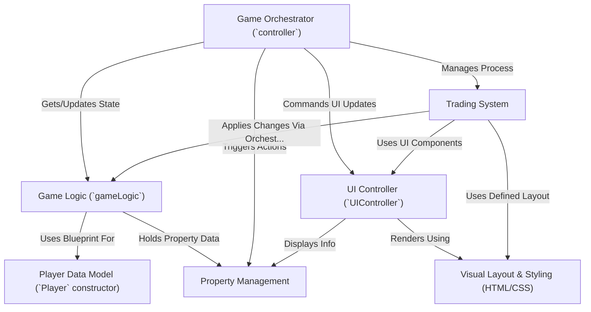

# Tutorial: monopoly-clone-og

This project is a digital clone of the classic **Monopoly** board game.
Players *roll dice*, move around the board, buy and manage *properties*, pay rent, and interact with Chance/Community Chest cards.
The game features a visual interface built with *HTML/CSS* and uses *JavaScript* to handle the game's rules, player turns, property management, building houses, and a **trading system** between players.
The objective is typically to become the wealthiest player or bankrupt opponents, depending on the chosen game mode (e.g., Last Man Standing or Timed).

**Source Repository:** [None](None)

## Chapters

1. [Visual Layout & Styling (HTML/CSS)
](01_visual_layout___styling__html_css__.md)
2. [UI Controller (`UIController`)
](02_ui_controller___uicontroller___.md)
3. [Game Orchestrator (`controller`)
](03_game_orchestrator___controller___.md)
4. [Game Logic (`gameLogic`)
](04_game_logic___gamelogic___.md)
5. [Player Data Model (`Player` constructor)
](05_player_data_model___player__constructor__.md)
6. [Property Management
](06_property_management_.md)
7. [Trading System
](07_trading_system_.md)

---

Generated by [AI Codebase Knowledge Builder](https://github.com/The-Pocket/Tutorial-Codebase-Knowledge)